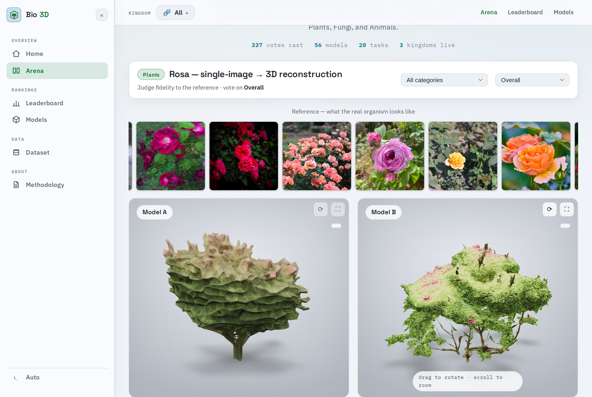
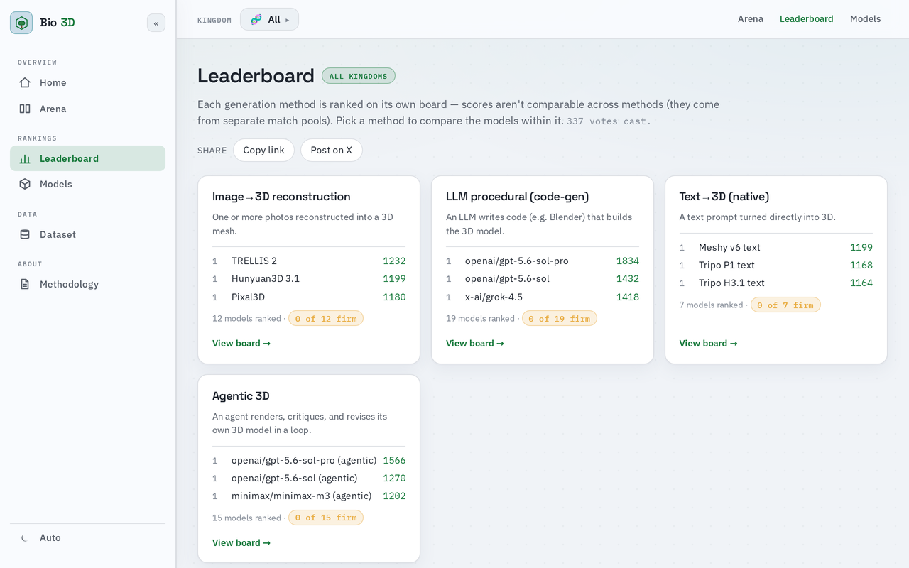

# 🧬 Taxon3D

**Which AI model actually rebuilds a living thing in 3D?**

[](https://taxon3d.org)
[](https://github.com/musharna/taxon3d/actions/workflows/ci.yml)
[](LICENSE)
[](CITATION.cff)
[](https://doi.org/10.5281/zenodo.21789280)
[](https://huggingface.co/datasets/musharna/taxon3d-corpus-v1)

> **Note** — this project was called _Bio 3D Arena_ until August 2026. The name collided with the
> [Bio3D R package](https://cran.r-project.org/package=bio3d) for protein structure analysis and
> with [Arena3D](https://arena3d.org/), so searching the name found neither of us. The site now
> lives at [taxon3d.org](https://taxon3d.org) and the repository at `musharna/taxon3d`; the old
> `bio3d-arena.fly.dev` host and repository path both still resolve, so nothing that linked to us
> has broken.

<picture>
  <source media="(prefers-color-scheme: dark)" srcset="docs/images/arena-dark.png">
  
</picture>

<sub>Screenshot taken 2026-08-03, before the rename, so it shows the old "Bio 3D" branding and
that day's counts; it has not been re-shot.</sub>

A [Chatbot-Arena](https://lmarena.ai/)-style platform for **blind comparison of
generative 3D models — of living organisms**. You get a biological task and two
anonymised 3D outputs, rotate and zoom each, and pick the closer one. Votes feed
Bradley–Terry rankings with bootstrap confidence intervals. A four-up ballot is
available at `/arena?set=kwise`; a pick-best-of-four is recorded as three pairwise
comparisons, so the statistics are pairwise either way.

**Why organisms.** Most 3D-generation evaluation runs on furniture and game props,
where "looks plausible" is close enough. A maize plant, a lion's mane mushroom and
a monarch butterfly are harder targets: self-similar branching structure, thin
surfaces, heavy self-occlusion, and a correctness criterion that is anatomical
rather than aesthetic. Every comparison is shown alongside CC-licensed reference
photographs of the real organism, so the question put to the voter is biological
fidelity, not taste.

|               |                                                                                                           |
| ------------- | --------------------------------------------------------------------------------------------------------- |
| **Tasks**     | 20 active, spanning plants, fungi and animals                                                             |
| **Outputs**   | 488 visible outputs from 52 generators (prod snapshot, 2026-09-06)                                        |
| **Paradigms** | single-image reconstruction · text→3D · LLM-authored procedural geometry · agentic render→critique→revise |
| **Ranking**   | Bradley–Terry (MM) with bootstrap 95% CIs, CI-grouped ranks                                               |

Counts come from `scripts/readme_stats.py`, run against a snapshot of the production database
taken 2026-09-06, and are stored in `docs/stats/readme.json`; a test holds this table to that
file. "Visible outputs" counts every output that is neither hidden nor a gold attention check,
which is not the same as the set the arena currently serves for voting.

> [!NOTE]
> **Maintenance mode since 2026-09-24.** Active development has stopped; the arena stays up
> and keeps collecting votes until a review on 2027-03-24 — see [docs/SUNSET.md](docs/SUNSET.md).
> Ranks are grouped by confidence interval, so generators the votes cannot tell apart share a
> rank rather than being ordered by noise. Each board states on its face how many further votes
> would firm its next model; on 2026-08-04 that was under twenty per board. You can still
> **[vote](https://taxon3d.org/arena)**.

## How it works

1. **Inspect** — two outputs for the same organism, orbit/zoom each. Generator
   identity is not shown to voters.
2. **Compare** — reference photographs of the real organism sit above the pair, so
   fidelity is judged against the subject rather than against the other model.
3. **Vote** — A, B, tie, or both-bad (`←` `→` `t` `x`).

<picture>
  <source media="(prefers-color-scheme: dark)" srcset="docs/images/leaderboard-dark.png">
  
</picture>

<sub>Screenshot taken 2026-08-03 (old "Bio 3D" branding, 337 votes at the time). This is the hub
page; the confidence-interval whiskers are on each method's own board.</sub>

### What keeps the numbers honest

- **Bradley–Terry with bootstrap 95% CIs**, and **CI-grouped ranks** — models whose
  intervals overlap share a rank, so statistical ties read as ties.
- **Pairwise significance** via paired bootstrap: P(A ranks above B), and whether a
  model actually beats the next rank down.
- **Bias audit** — left-win-rate, tie/both-bad rate, and cross-format confounds.
- Both are computed on an internal instance only. They are not published on taxon3d.org:
  the public deploy returns 404 for `/significance`, `/api/significance` and `/api/bias`.
- **Vote integrity** — gold-standard attention checks score voter trust, low-trust
  sessions are excluded from the fit, plus rate limiting, per-session dedup, and an
  optional captcha.
- **Self-comparison excluded** — a generator is never matched against itself, which
  otherwise pumps its own strength estimate.
- **One board per paradigm.** Scores are not comparable across generation methods,
  because they come from separate match pools — an image→3D score and a text→3D
  score are not on the same scale, so the site does not put them in one ranking.

### Also in the box

- **A format-keyed viewer registry** (side feature) — `<model-viewer>` for GLB/GLTF,
  **3Dmol.js** for PDB/mmCIF and SDF/MOL. See [Other 3D formats](#other-3d-formats).
- **Reference galleries are quality-gated, not just correctly labelled.** Sourcing
  on taxonomic correctness alone let through a heron holding a goldfish — a valid
  _Carassius auratus_ record and a useless reference — and dingoes standing in for
  domestic dogs. A VLM subject check now asks what the photo's _main subject_ is
  and whether it is in the form the task asks for.
- **A public [methodology page](https://taxon3d.org/methodology)**, and an
  admin surface for adding categories, criteria, tasks and generators.

## Architecture

Single FastAPI app, server-rendered (Jinja2) + vanilla JS, SQLAlchemy over SQLite
(dev and deployed; Postgres is supported but no longer used), 3D rendered client-side.
One Docker container; asset blobs on local disk or S3-compatible object storage. The
live instance runs on Fly.io with a SQLite file on a Fly volume, Cloudflare R2 for assets and
Cloudflare in front for edge caching — see [`deploy/README.md`](deploy/README.md) and
[`docs/cloudflare-runbook.md`](docs/cloudflare-runbook.md).

```
app/
  main.py          app setup + public pages (home, leaderboard, models, organisms,
                   dataset, static pages, OG images, auth, health)
  routes/
    vote.py        /arena, /study, ballot + vote APIs, opaque /media/o asset routes
    admin.py       /admin routes and the admin token checks
    research.py    research JSON (internal-only), recon benchmark, ingestion API,
                   submission queue
  web_common.py    helpers shared by main.py and the routers
  config.py        settings read from the environment
  models.py        SQLAlchemy data model
  ranking.py       Elo + Bradley–Terry (+ bootstrap CIs)   [pure functions]
  matchmaking.py   pair / task selection (prefers under-sampled outputs)
  service.py       apply-vote (Elo), recompute-leaderboard (BT), significance, bias
  licensing.py     REDISTRIBUTABLE_LICENSES
  public_export.py display / redistribute export postures
  seed.py          demo categories/criteria/generators/tasks/outputs
  assets_gen.py    procedural GLB generation (trimesh) for demo data
  …                ~70 more modules: corpus building, scoring, reference sourcing
  templates/       Jinja2 pages
  static/          CSS + JS (arena.js, leaderboard.js, viewer.js, …)
scripts/           corpus, harvest, stats and maintenance scripts
data/              SQLite DB + asset blobs (gitignored; regenerated by seed)
tests/             pytest
```

## Data model

`Category` → `Task` → `ModelOutput` (per `Generator`); a `Comparison` records a
shown pair, a `Vote` records the judgment, and `Rating` caches Elo + BT per
(generator × scope × criterion). Taxonomy (`Category`) and evaluation axes
(`Criterion`) are first-class tables, so new biological categories and scoring
criteria are added by inserting rows — no schema change.

## Ranking methodology

- **Elo** updates on every vote (K=32, ties = 0.5) for instant feedback.
- **Bradley–Terry** is fit by MM iteration over the decisive votes plus ties, each tie
  counted as one win in each direction (both-bad votes are left out), and rescaled to an Elo-like range; **bootstrap resampling** yields 95% CIs so
  generators are ranked with uncertainty. Recompute from Admin (or `POST
/admin/recompute`). Light symmetric regularization keeps the MLE finite when a
  generator has only wins or only losses.
- **CI-grouped Rank (Upper Bound)** — generators whose 95% CIs overlap share a
  rank (`rank = 1 + count(models whose lower CI > this model's upper CI)`), shown
  as "Rank (UB)" in the leaderboard. Each row shows a **CI whisker bar** (shaded
  confidence interval + point estimate) so statistical ties are visible at a glance.

## Quick start (local)

```bash
python3 -m venv .venv && source .venv/bin/activate
pip install -r requirements-dev.txt   # runtime + research + test/lint (see below)
python -m app.seed                 # creates demo data + procedural GLB assets
uvicorn app.main:app --reload      # http://127.0.0.1:8000
```

Dependencies are layered, each file including the one above it:

| File                        | Contains                                                          | Install it when                |
| --------------------------- | ----------------------------------------------------------------- | ------------------------------ |
| `requirements.txt`          | what serving needs, and nothing else                              | deploying the public instance  |
| `requirements-research.txt` | + volumetric conversion, mesh decimation, VLM judge, CLIP/BioCLIP | building or scoring the corpus |
| `requirements-dev.txt`      | + pytest, httpx, ruff                                             | contributing                   |

The split is load-bearing, not cosmetic: `open_clip_torch` pulls `torch` and the full NVIDIA CUDA
stack. Measured once on a clean venv on 2026-07-23 (not re-run since), a runtime-only install was
173 MB against 5.6 GB for the full one. `tests/test_runtime_deps.py` enforces the split, not the
sizes: it fails if serving the public app imports the research stack, or if an app import is
missing from the runtime requirements.

Open <http://127.0.0.1:8000> to vote, `/leaderboard` for rankings, `/tasks` to
browse benchmark tasks, `/admin` for admin tools (token below).

## Configuration

<details>
<summary><b>Core environment variables</b></summary>

| Variable             | Default                     | Purpose                          |
| -------------------- | --------------------------- | -------------------------------- |
| `BIO3D_DATA_DIR`     | `./data`                    | DB + asset blob directory        |
| `BIO3D_DATABASE_URL` | `sqlite:///<DATA>/arena.db` | swap for Postgres at scale       |
| `BIO3D_ADMIN_TOKEN`  | `changeme-admin-token`      | shared bearer token for `/admin` |
| `BIO3D_ELO_K`        | `32`                        | Elo K-factor                     |
| `BIO3D_BT_BOOTSTRAP` | `200`                       | bootstrap resamples for BT CIs   |

</details>

<details>
<summary><b>Required on a public deploy</b> — the app refuses to start without these</summary>

A "public deploy" is one with an empty `BIO3D_RECON_SCORER_URL`. It **refuses to start**
without these — each was a silently-wrong default that only showed up in production:

| Variable                | Why it must be set                                                                                                    |
| ----------------------- | --------------------------------------------------------------------------------------------------------------------- |
| `BIO3D_ADMIN_TOKEN`     | otherwise `/admin` accepted a token published in this source tree                                                     |
| `BIO3D_PUBLIC_BASE_URL` | share cards, `og:*`, `rel=canonical` and `/sitemap.xml` all advertise this origin — the default points at `127.0.0.1` |

</details>

<details>
<summary><b>Human verification</b> (optional captcha)</summary>

Off by default: with no captcha configured the arena loads no third-party script at all.
Turning it on requires **both** keys — the app refuses to start with the switch on and either
key missing, because an enabled-but-unconfigured captcha does not weaken voting, it blocks it.

| Variable                 | Default     | Purpose                                           |
| ------------------------ | ----------- | ------------------------------------------------- |
| `BIO3D_REQUIRE_CAPTCHA`  | `false`     | master switch for human verification              |
| `BIO3D_CAPTCHA_PROVIDER` | `turnstile` | `turnstile` (Cloudflare) or `hcaptcha`            |
| `BIO3D_CAPTCHA_SITE_KEY` | _(empty)_   | **public** key; renders the widget in the browser |
| `BIO3D_CAPTCHA_SECRET`   | _(empty)_   | **private** key; verifies the token server-side   |

A voter is challenged **once per session**, not once per vote: provider tokens are single-use
and short-lived, so per-vote verification would put a round-trip in front of every vote. A
rejected token leaves the session unverified, so the next vote is challenged again.

</details>

<details>
<summary><b>Production scale-out</b> — Postgres, S3, Redis</summary>

Each seam is a config switch; the core app stays dependency-free until you enable
one. `pip install -r requirements-scale.txt` for the backends you turn on.

| Variable                                       | Purpose                                                                       |
| ---------------------------------------------- | ----------------------------------------------------------------------------- |
| `BIO3D_DATABASE_URL`                           | `sqlite:////data/arena.db` (prod) or `postgresql+psycopg://…` → pooled engine |
| `BIO3D_DB_POOL_SIZE` / `BIO3D_DB_MAX_OVERFLOW` | connection pool sizing (non-SQLite)                                           |
| `BIO3D_STORAGE_BACKEND`                        | `local` (default) or `s3` (object storage)                                    |
| `BIO3D_S3_BUCKET` / `BIO3D_S3_PREFIX`          | bucket + key prefix for the S3 backend                                        |
| `BIO3D_S3_PUBLIC_BASE_URL`                     | serve assets via a CDN domain instead of presigned URLs                       |
| `BIO3D_REDIS_URL`                              | `redis://…` → rate limiting shared across workers                             |

Storage (`app/storage.py`) abstracts asset blobs behind a `StorageBackend`
(local filesystem or S3, lazy `boto3`); the DB engine adds a real connection pool
for Postgres; the rate limiter swaps to a Redis-backed fixed window. The S3/
Postgres/Redis paths are implemented and unit-tested for selection/URL logic but
need live infra to exercise end-to-end.

</details>

## Docker

```bash
docker build -t taxon3d .
docker run -p 8000:8000 -e BIO3D_ADMIN_TOKEN=... -v $PWD/data:/data taxon3d
```

The image runs as the unprivileged `app` user (uid 10001), so a bind-mounted `data/` must be
writable by that uid (`chown -R 10001 data` or `chmod -R a+rwX data`); the same applies to the
Fly volume — see the Dockerfile. CI builds the image on every push, so a broken Dockerfile fails
there rather than at `flyctl deploy`.

## Tests

```bash
pytest -q        # ranking, vote integrity, licensing gates, scale-out seams (~2,000 tests)
```

## Other 3D formats

A side feature, not part of the organism benchmark. The viewer is keyed by format:

| Format      | Viewer           | Notes                                                                    |
| ----------- | ---------------- | ------------------------------------------------------------------------ |
| GLB / GLTF  | `<model-viewer>` | meshes; the organism outputs                                             |
| PDB / mmCIF | 3Dmol.js         | atomic-resolution protein / nucleic-acid structures                      |
| SDF / MOL   | 3Dmol.js         | small-molecule connection tables; keeps bond orders and stereochemistry  |

`app/benchmarks.py` registers curated, openly-licensed assets listed in
`app/data/benchmarks/manifest.json` on `python -m app.seed` (content-hash deduplicated, so
re-running is safe). The manifest is empty: the protein and small-molecule examples it used to
carry were removed on 2026-06-21 when the project narrowed to organisms. The required fields are
in `REQUIRED_FIELDS` in `app/benchmarks.py`. No further formats are planned.

## Ingesting real generator outputs

Generator pipelines register baked 3D assets programmatically (no DB access).
Auth is the `X-Admin-Token` header. Assets are **validated** (must parse + have
geometry) and **deduplicated** by content hash within a (task, generator).

JSON/upload endpoints:

- `GET  /api/tasks` — list task ids/slugs to target.
- `POST /api/categories` · `POST /api/generators` — upsert by slug.
- `POST /api/tasks` — create a task (`{category, title, prompt}`).
- `POST /api/outputs` — multipart upload (`task_id`, `generator_slug`, optional
  `generator_name`, `title`, `meta` JSON, `file`). Returns `{id, created, ...}`
  (`created=false` when an identical asset was already registered).

Python client (`app/client.py`) + runnable example (`scripts/ingest_example.py`):

```python
from app.client import Taxon3DClient

c = Taxon3DClient("http://localhost:8000", admin_token="...")
c.upsert_category("flowers", "Flowers")
task = c.create_task("flowers", "Rose bloom", "Generate an open rose.")
c.upsert_generator("my-rose-gen", "My Rose Generator")
c.register_output(task["id"], "my-rose-gen", "out.glb", meta={"seed": 7})  # bake gene/params → GLB
c.recompute()
```

Replace the example's `bake_glb(...)` with your generator (flower-sim,
Blender/GeoNodes rose, plant world model, …) producing a GLB from a
gene/parameter vector or prompt.

## Research API

- `GET /api/meta` — categories + criteria (drives the selectors).
- `GET /api/next?criterion=<slug>&category=<slug>` — anonymized pair, scoped.
- `POST /api/vote?criterion=&category=` — record + next (keeps the filter).
- `GET /api/leaderboard?criterion=<slug>&category=<slug>` — sliced rankings.
- `GET /api/export.json` — full reproducible dataset (votes + provenance,
  generators revealed for offline analysis).
- `GET /api/significance?criterion=&category=` — pairwise P(A ranks above B)
  matrix + per-rank "beats next?" significance (paired bootstrap). Page: `/significance`.
- `GET /api/bias` — position/format bias audit + gold pass-rate + low-trust count.
- The two endpoints above and the `/significance` page exist only on an internal instance
  (`BIO3D_INTERNAL_PAGES`, on by default when a scorer URL is configured). The public deploy at
  taxon3d.org returns 404 for them.
- `POST /api/vote` is rate-limited, deduplicated, and trust-scored; ~`GOLD_RATE`
  of comparisons are gold attention checks. Tunables: `BIO3D_VOTE_RATE_LIMIT`,
  `BIO3D_VOTE_RATE_WINDOW`, `BIO3D_GOLD_RATE`, `BIO3D_TRUST_THRESHOLD`,
  `BIO3D_REQUIRE_CAPTCHA`. See `/methodology`.

Ties are credited as a split (one win each direction) so they inform
Bradley–Terry. `POST /admin/recompute` refits every (criterion × {global + each
category}) scope.

## Roadmap

1. ✅ Data model + DB + seed (procedural GLB demo assets)
2. ✅ Pairwise voting + dual 3D viewer
3. ✅ Elo + leaderboard
4. ✅ Admin tools (CRUD + GLB upload + recompute)
5. ✅ Bradley–Terry + bootstrap CIs
6. ✅ Multi-criterion evaluation: per-criterion and per-category voting,
   per-(criterion × category) leaderboard slices, tie-aware ranking, dataset export.

No further development is planned. Since 2026-09-24 the project is in maintenance mode, with a
review on 2027-03-24; see [docs/SUNSET.md](docs/SUNSET.md).

## Notes

- `<model-viewer>` is loaded from a CDN; vendor it locally for offline use.
- The procedural demo assets exist only so the arena works out of the box — real
  deployments upload generator outputs via `/admin`.

## License

The **code** in this repository is MIT-licensed — see [LICENSE](LICENSE).

The **corpus is not in this repository.** `data/` is gitignored; what you are cloning
is the arena software, its tests and its documentation. That distinction is
deliberate, because the corpus is not uniformly redistributable:

> The part that **is** redistributable is published separately, on the Hugging Face Hub as
> [`musharna/taxon3d-corpus-v1`](https://huggingface.co/datasets/musharna/taxon3d-corpus-v1) —
> the redistributable subset of the corpus (the card states how many of the candidate outputs
> ship and itemises every withheld one), with the admissibility verdicts that gate them. The
> split follows exactly the rule below. Every vote the
> leaderboard counts ships too (`preferences.jsonl`): a withheld side is named by output id,
> generator and licence only, since the preference labels are ours even where the mesh is not.

- **Generated 3D outputs** carry the terms of whichever model produced them. Some are
  freely redistributable (MIT-licensed generators such as TRELLIS, TripoSR and
  PartCrafter; outputs authored by LLMs whose terms assign output to the caller).
  Others are **display-only** — several hosted closed models grant the right to use
  and show an output but no redistribution grant. The arena shows those and does not
  offer them for download.
- **Reference photographs and ground-truth scans** are Creative-Commons only, with
  per-photo attribution recorded in each gallery manifest and rendered as the credit
  line beside the image. Share-alike photos are included and carry their attribution;
  non-commercial and no-derivatives licenses are excluded outright.

One list answers "may we redistribute this?" — `REDISTRIBUTABLE_LICENSES` in
[`app/licensing.py`](app/licensing.py). Export runs in one of two postures, _display_
or _redistribute_, and `filter_include_for_posture` in
[`app/public_export.py`](app/public_export.py) drops anything the posture does not
clear. Do not re-declare that list elsewhere; it has drifted before.

This is a description of how the project handles licensing, not legal advice.

## Citing

[`CITATION.cff`](CITATION.cff) — GitHub renders a "Cite this repository" button from it.

## Acknowledgements

Reference imagery comes from [iNaturalist](https://www.inaturalist.org/) observers and
[Wikimedia Commons](https://commons.wikimedia.org/) contributors under Creative Commons
licenses; each photograph's author is credited in the interface beside the image.
